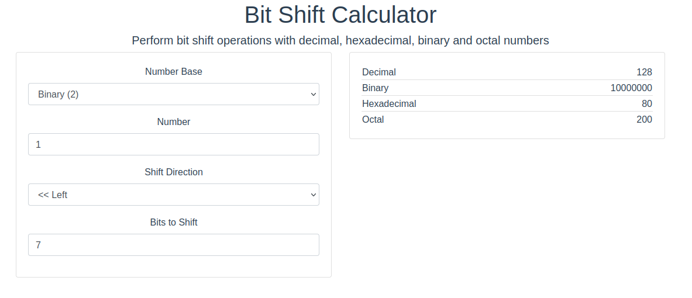

# Practica 1 DSI

## 1.4 Warm-up 

Seguimos los pasos especificados para realizar una conexion por ssh a la BeagleBone Black.

## 1.4.1 GPIO pins

Para conectar a la placa el LED buscamos la configuracion de pines en P1 Introduction (diapo 7 Cape expansion headers) donde se especifica cada uno de los pines y su funcion.

Conectamos una patilla del LED al pin 42 y el otro al 44 del bloque P9 de pines de la placa.

Para hacer brillar el LED seguimos los pasos especificados en la practica.

## 1.4.2 Javascript and Cloud9

Seguimos los pasos de la practica para poder acceder por el navegador a Cloud9.

Para poder acceder correctamente y evitar el error "tmux requiere UTF-8":

`sudo nano /etc/default/cloud9`

    LC_CTYPE=C.UTF-8 
    NODE_PATH=/usr/local/lib/node_modules

`sudo nano /home/debian/.profile`

    NODE_PATH=/usr/local/lib/node_modules/

Codigo de la tarea para hacer parpadear el led en secuencia: (blink.js)

```js
#!/usr/bin/env node
var b = require('bonescript');

/*var leds = ["USR0", "USR1", "USR2", "USR3", "P9_14"];*/
var leds = ["USR0", "USR1", "USR2", "USR3"];

for(var i in leds) {
    b.pinMode(leds[i], b.OUTPUT);
}

var loop = 0;

var state = b.LOW;
var LOW = b.LOW;

for(var i in leds) {
    b.digitalWrite(leds[i],state);
}   

setInterval(toggle, 1000);

function toggle() {

    //if(state == b.LOW) state = b.HIGH;
    //else state = b.LOW;
    
    for(var i in leds) {
        if(i == loop){
            b.digitalWrite(leds[i],b.HIGH);
        }else{
            b.digitalWrite(leds[i],b.LOW);
        }
    }
    loop++;
    if (loop == 4){
    loop = 0;
}
}
```

## 1.4.3 Programar en C/C++ en la BBB

Codigo de la tarea para hacer parpadear un LED: (prueba_leds_1_4_3.cpp)

```cpp
#include <iostream>
#include <fstream>
#include <string>
#include <unistd.h>
using namespace std;
 
#define LED0_PATH "/sys/class/leds/beaglebone:green:usr0"
 
int main(int argc, char* argv[]){
   
   std::fstream fs;
   cout << "Starting the LED flash program" << endl;
   cout << "The LED Path is: " << LED0_PATH << endl;     
  
    fs.open (LED0_PATH "/trigger", std::fstream::out);
    fs << "timer";
    fs.close();
    fs.open (LED0_PATH "/delay_on", std::fstream::out);
    fs << "25";
    fs.close();
    fs.open (LED0_PATH "/delay_off", std::fstream::out);
    fs << "25";
    fs.close();
  
   cout << "Finished the LED flash program" << endl;
   return 0;
}
```

Otro ejemplo de codigo para hacer parpadear pero apagandolo y encendiendolo sin trigger:

```cpp
#include <iostream>
#include <fstream>
#include <string>
#include <unistd.h>
using namespace std;
 
#define LED0_PATH "/sys/class/leds/beaglebone:green:usr0"
 
int main(int argc, char* argv[]){
   
   std::fstream fs;
   cout << "Starting the LED flash program" << endl;
   cout << "The LED Path is: " << LED0_PATH << endl; 
   
  while(1){
     fs.open (LED0_PATH "/brightness", std::fstream::out);
     fs << "0";
     fs.close();
     usleep(100000);
     fs.open (LED0_PATH "/brightness", std::fstream::out);
     fs << "1";
     usleep(100000);
  }
   cout << "Finished the LED flash program" << endl;
   return 0;
}
```

## 1.4.4 Otras formas de interactuar con los pines GPIO

Codigo de la tarea de modificar el programa anterior incluyendo 100 us entre el encendido y el apagado: (prueba_leds_1_4_4.cpp)

```cpp
#include <iostream>
#include <fstream>
#include <string>
#include <unistd.h>
using namespace std;
 
#define LED0_PATH "/sys/class/leds/beaglebone:green:usr0"
 
int main(int argc, char* argv[]){
   
   std::fstream fs;
   cout << "Starting the LED flash program" << endl;
   cout << "The LED Path is: " << LED0_PATH << endl;     
  
    fs.open (LED0_PATH "/trigger", std::fstream::out);
    fs << "timer";
    fs.close();
    fs.open (LED0_PATH "/delay_on", std::fstream::out);
    fs << "25";
    usleep(100);
    fs.close();
    fs.open (LED0_PATH "/delay_off", std::fstream::out);
    fs << "25";
    fs.close();
  
   cout << "Finished the LED flash program" << endl;
   return 0;
}
```

 Ejecutamos a su vez : `cat /dev/zero > /dev/null`


Codigo de la tarea en la que modificamos devmem2 para hacer parpadear el led: (devmem2.cpp)

```c
#include <fcntl.h>
#include <sys/mman.h>
#include <stdio.h>
#include <unistd.h>

int main(){
    int fd = open("/dev/mem", O_RDWR | O_SYNC);
    void *map_base = mmap(0, 4096, PROT_READ | PROT_WRITE, MAP_SHARED,
         fd, 0x44E07000);
    while (1) {
        *(unsigned long *)(map_base + 0x194) = 0x00000080;
        usleep(100000);
        *(unsigned long *)(map_base + 0x190) = 0x00000080;
        usleep(100000);
    }
}
```

Para adaptar el codigo prporcionado a lo que se pide modificamos  en *map_base el ultimo parametro al valor de direccion del GPIO0 (0x44E07000).

Por ultimo cambiamos las direcciones de 0x00200000 a 0x00000080 ya que es un 1 shifteado 7 veces.



## 1.6 Paquete Debian

Estructura de ficheros para crear el paquete Helloworld:

```cmd
.
└── helloworld-0.1
    ├── debian
    │   ├── changelog
    │   ├── compat
    │   ├── control
    │   ├── copyright
    │   ├── files
    │   └── rules
    ├── helloworld-0.1.orig.tar.gz
    ├── Makefile
    └── src
        ├── helloworld
        └── helloworld.c
```

Finalmente ejecutamos  `debuild -us -uc`  para crear el paquete.

Estructura de ficheros para crear el paquete blink:

```cmd
.
└── blink-0.1
    ├── blink-0.1.orig.tar.gz
    ├── debian
    │   ├── changelog
    │   ├── compat
    │   ├── control
    │   ├── copyright
    │   └── rules
    ├── Makefile
    └── src
        ├── blink
        └── blink.cpp
```