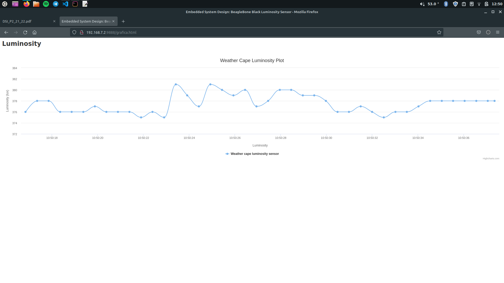

# Practica 2 DSI

## 2.2 Capa Grove para la BBB

Para visualizar los valores del sensor, conectamos la capa sobre la BBB y conectamos el sensor al Analog Input (AIN0) situado en una de las esquinas.
De esta manera podremos visualizar por terminal los valores que emita el sensor con:
    
    cd /sys/bus/iio/devices/iio:device0
    ls -F
    cat in_voltage0_raw 

Con `cat in_voltage0_raw` obtenemos un valor leido del puerto analogico tal como 1530 y que nunca va a ser menor que 0, que seria teniendo el sensor a oscuras si lo tapas con la mano por ejemplo.

Un programa que nos permite realizar lecturas simultaneas seria:

```js
var b = require('bonescript');

b.analogRead('P9_39',printStatus);
function printStatus(x) {
	console.log('x.value = ' + x.value);
}
```

Basicamente lo que hace este programa es utilizar utilizar la libreria de node.js bonescript para hacer lecturas de los sensores conectados a las capas de la BBB.


## 2.4 Web Light Sensor
 
### 2.4.1 Conectividad a Internet en la BBB

En este caso segui los pasos para dar conexion a internet a la beagle a traves del cable USB conectado a mi pc que tiene Linux Mint instalado. Para realizar los ejercicios no se uso la red de la universidad sino la prporcionada por mi red movil ya que la de la universidad daba ciertos problemas.

Ejecutamos en un terminal:
    
    sudo su
    iptables --table nat --append POSTROUTING --out-interface eth0 -j MASQUERADE
    iptables --append FORWARD --in-interface eth7 -j ACCEPT
    echo 1 > /proc/sys/net/ipv4/ip_forward

Si queremos poder resolver nombres de dominio DNS ejecutamos como root:

    echo "nameserver 8.8.8.8" >> /etc/resolv.conf

### 2.4.2 Ejemplo

Seguimos los pasos de la practica para descargar de git el repositorio con el ejemplo y las utilidades necesarias como socket.io.
Ejecutamos `node weatherserver.js` y vamos a http://192.168.7.2:8888 para visualizar la pagina web creada. 


## 2.5 Light Sensor Chart

Para la tarea especificada modifique algunos de los ficheros contenidos en la carpeta weatherserver de tal manera que se sirva al navegador web un html a mayores, para el grafico del sensor de luz.



Codigo drawChart.js:
```js
var chart;
console.log("Starting grafico.js");
chart = new Highcharts.Chart("grafica",{
chart: {
renderTo: "grafico",
defaultSeriesType: 'spline',
},
title: {
text: 'Weather Cape Luminosity Plot'
},
xAxis: {
type:'datetime',
tickPixelInterval: 150,
maxZoom: 20*1000,
title: {
text: 'Luminosity',
margin: 15
}
},
yAxis: {
minPadding: 0.2,
maxPadding: 0.2,
title: {
text:'Luminosity (lux)',
margin: 15
}
},
series: [{
name:'Weather cape luminosity sensor',
data: []
}]
});

var socket = new io.connect();
socket.on('connect', function() {
  //document.getElementById("status").innerHTML="Connected";
  //$('#animateTest').removeClass().addClass('fadeIn');
});

let i=0;

socket.on('lux', function(data) {
  var myData = parseFloat(data);
  lux = myData;
  console.log(lux);

  let point = [Date.now(),lux];

  if(i >= 45){
  	chart.series[0].addPoint(point, true, true);
  }else{
	 chart.series[0].addPoint(point, true, false);
  }
  
  i++;

});
```
El anterior codigo .js define la estructura y datos necesarios para la libreria de highcharts para hacer el display de la grafica, seguido de la creacion y conexion a un socket para recibir los datos de la BBB.

Dentro de la funcion socket.on('lux',function(data)) realice una modificacion para que solo se haga un display de los 45 valores mas recientes, y que asi no se grafiquen todos los valores, haciendo un desplazamiento del ultimo valor de la lista y anadiendo el nuevo valor, aunque este desplazamiento solo se realiza cuando tengamos por lo menos 45 valores ya graficados.

Para anadir un nuevo valor utilizamos `chart.series[0].addPoint(valor,true,shift)` donde shift puede tomar el valor true o false para hacer el desplazamiento comentado anteriormente. 


Codigo grafica.html:

```html
<html>
	<head>
		<title>Embedded System Design: BeagleBone Black Luminosity Sensor</title>
		<style type="text/css" media="all">@import "/style.css";</style>
		<script src="http://code.highcharts.com/highcharts.js"></script>
		<meta name="viewport" content="width=device-width, initial-scale=1, maximum-scale=1" />
	</head>
	<body>
		<h1 id="heading">Luminosity</h1>
		<br/>
	
		<div id="grafica"></div>		

		<script src="/socket.io/socket.io.js"></script>
		<script type="text/javascript" src="drawChart.js"></script>
	</body>
</html>
```

En el codigo .html anterior definimos en el head, dentro de un script, las referencia a la libreria highcharts.js, que sera utilizada para hacer el display.

Al final del codigo cargaremos los ficheros .js necesarios para printear los valores medidos por el sensor. Utilizaremos socket.io.js para la comunicacion y envio de datos y drawChart.js (mencionado anteriormente) para la logica del display.

El archivo weatherserver.js que crea el server y lo pone a escuchar en el puerto 8888 no es necesario modificarlo, ya que por defecto si se le pasa por el navegador alguna URL diferente a http://192.168.7.2:8888/ tal como http://192.168.7.2:8888/grafica.html, cargara el fichero con ese nombre.

## Servicios

Codigo del servicio myfancyapp.service (ejecuta el programa weatherserver.js pero el servicio se llama myfancyapp):

```bash
[Unit]
Description=MyFancyApp server

[Service]
WorkingDirectory=/home/debian/Practica2/weatherstation
EnvironmentFile=/etc/default/node
ExecStart=/usr/bin/node /home/debian/Practica2/weatherstation/weatherserver.js
SyslogIdentifier=myfancyapp

[Install]
WantedBy=multi-user.target
```

Con este codigo definimos nuestro servicio con el nombre myfancyapp, con el dierectorio desde donde se va a iniciar el servicio (WorkingDirectory), el path al archivo de entorno de node que el programa va a utilizar (EnvironmentFile) y el comando para inicar el servicio, introduciendo paths absolutos para node y para el archivo del servidor a ejecutar (ExecStart).

Para habilitar que el servicio se inicie en el arranque del sistema ejecutamos `sudo systemctl enable myfancyapp` o por lo contrario `sudo systemctl disable myfancyapp`.

Si queremos iniciar el servicio ejecutamos `sudo systemctl start myfancyapp` o para pararlo `sudo systemctl stop myfancyapp`.

Codigo para la creacion del paquete Debian:


ACABAR LA TAREA DE EXPLICAR EL CODIGO WEATHERSERVER


