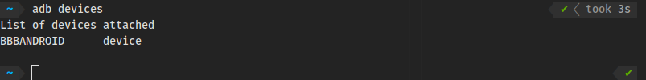

# Practica 4

## 4.2 Set-up

Para comprobar si el Android Debug Bridge detecta el dispositivo, primero lo instalamos con sudo apt install android-tools-adb y posteriormente listamos con adb devices. Si el dispositivo es detectado veremos a la salida del comando:



Una vez conseguimos que se detecte el dispositivo podremos acceder con ```adb shell```

Nota: Deberiamos comprobar que el led se ilumina como hicimos en la practica 1 para evitar errores al intentar interactuar con el en los siguientes ejercicios:

```echo 1 > /sys/class/leds/beaglebone:green:usr3/brightness```\
```echo 0 > /sys/class/leds/beaglebone:green:usr3/brightness```


Para que las aplicaciones que programemos tengan permisos para escribir sobre el fichero que controla el brillo del led tenemos que darle permisos con el comando:

```chmod 0666 /sys/class/leds/beaglebone:green:usr3/brightness```

## Ejercicio1 

```java
import androidx.appcompat.app.AppCompatActivity;

import android.os.Bundle;
import android.view.View;
import android.widget.Button;

import java.io.File;
import java.io.FileInputStream;
import java.io.FileOutputStream;
import java.io.IOException;

public class MainActivity extends AppCompatActivity {

    @Override
    protected void onCreate(Bundle savedInstanceState) {
        super.onCreate(savedInstanceState);
        setContentView(R.layout.activity_main);

        Button onButton = (Button) findViewById(R.id.button_on);

        onButton.setOnClickListener(new View.OnClickListener() {
            public void onClick(View v) {
                try {
                    setOnButton();
                } catch (IOException e) {
                    e.printStackTrace();
                }
            }
        });

        Button offButton = (Button) findViewById(R.id.button_off);

        offButton.setOnClickListener(new View.OnClickListener() {
            public void onClick(View v) {
                try {
                    setOffButton();
                } catch (IOException e) {
                    e.printStackTrace();
                }
            }
        });
    }

    private static final String led = "/sys/class/leds/beaglebone:green:usr3/brightness";

    public void setOnButton() throws IOException {
        FileInputStream fileInputStream;
        FileOutputStream fileOutputStream;
        File file = new File(led);
        if (file.canRead()){
            fileInputStream = new FileInputStream(file);
            if (fileInputStream.read() == '1') {
                System.out.println("LED usr3 already ON\n");
                return;
            } else System.out.println("Turning LED ON\n");
        } else {
            System.out.println("Can’t read LED\n");
        }
        if (file.canWrite()) {
            fileOutputStream = new FileOutputStream(file);
            fileOutputStream.write('1');
        }
    }

    public void setOffButton() throws IOException {
        FileInputStream fileInputStream;
        FileOutputStream fileOutputStream;
        File file = new File(led);
        if (file.canRead()){
            fileInputStream = new FileInputStream(file);
            if (fileInputStream.read() == '0') {
                System.out.println("LED usr3 already OFF\n");
                return;
            } else System.out.println("Turning LED OFF\n");
        } else {
            System.out.println("Can’t read LED\n");
        }
        if (file.canWrite()) {
            fileOutputStream = new FileOutputStream(file);
            fileOutputStream.write('0');
        }
    }

}
```

Se adjunta un video de prueba del ejercicio en la carpeta Ejercicio1.

## Ejercicio 2

Para este ejercicio al igual que el anterior modificamos el valor del led, de encendido a apagado, pero en este caso con un switch.

El codigo desarrollado se realizo con el NDK (Native Development Kit) para poder incluir codigo c++ en la aplicacion.

Codigo del MainActivity.java:

```java
public class MainActivity extends AppCompatActivity {

    // Used to load the 'led_20_ndk' library on application startup.
    static {
        System.loadLibrary("led_20_ndk");
    }

    private ActivityMainBinding binding;

    @Override
    protected void onCreate(Bundle savedInstanceState) {
        super.onCreate(savedInstanceState);

        binding = ActivityMainBinding.inflate(getLayoutInflater());
        setContentView(binding.getRoot());

        Switch onSwitch = (Switch) findViewById(R.id.switch1);

        onSwitch.setOnCheckedChangeListener(new CompoundButton.OnCheckedChangeListener() {
            public void onCheckedChanged(CompoundButton buttonView, boolean isChecked) {
                
                if(isChecked == true){
                    changeLed(1);
                }else {
                    changeLed(0);
                }
            }
        });

    }
```

Codigo native-lib.cpp:

```c++
#include <jni.h>
#include <string>
#include <iostream>
#include <fstream>
#include <stdio.h>


extern "C"
JNIEXPORT void JNICALL
Java_com_led_120_1ndk_MainActivity_changeLed(JNIEnv *env, jobject thiz, jint estado_led) {

    std::fstream fs;

    fs.open ("/sys/class/leds/beaglebone:green:usr3/brightness", std::fstream::out);

    if(estado_led == 1) {
        fs << "1";
    }else{
        fs << "0";
    }
    fs.close();

    return;
}
```

Se adjunta un video de prueba del funcionamiento del ejercicio en la carpeta Ejercicio2.
